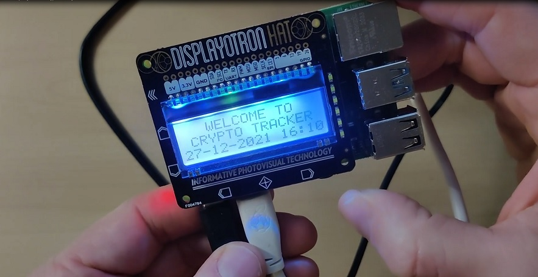

# Crypto_Tracker
Tracks and displays the value of ETH and BTC in real time, in colour

Simply press the button and the display shows the current ETH value (in £).  The next button will display BTC (in £)

Next time you press either button the display will compare the current value with the previous.  If the value has increased the display will turn green, if the value has decreased the display will change top red.  Orange denotes that the value is the same as when you last checked.

The display also shows the current date and time for reference.

# To Use

- Use Python 3+
- This version built using Raspberry Pi 4
- Download or clone this repo.
- Ensure your device is online
- Display from https://shop.pimoroni.com/products/display-o-tron-hat

Video of project: https://www.youtube.com/watch?v=SoIWA1JHCac

